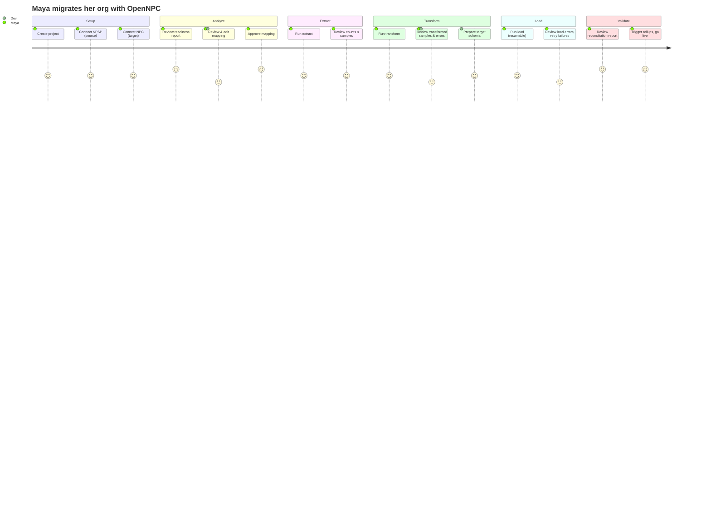

# 02 · Scope & Personas

[← Vision & Goals](01-vision-and-goals.md) · [Index](README.md) · Next: [Architecture →](03-architecture.md)

---

## 1. Personas

### P1 — Nonprofit Salesforce Admin ("Maya")
- Runs a single org for one nonprofit; comfortable in Setup, Data Loader, reports.
- Not a developer. Wants a guided UI, clear progress, and confidence nothing is lost.
- **Needs:** plain-language readiness report, review gates, a reconciliation report she can show
  leadership, and the ability to pause overnight and resume.

### P2 — Implementation Consultant / SI Partner ("Dev")
- Migrates many client orgs; cares about repeatability and per-client customization.
- **Needs:** editable mapping definitions, the ability to re-run a single stage after fixing a
  mapping, exportable artifacts, and a fast path to repeat the process for the next client.

### P3 — Developer / Contributor ("Sam")
- Extends the platform: adds object mappings, custom transforms, new validators.
- **Needs:** clean plugin/mapping interfaces, local dev with Docker, tests, and good docs.

## 2. User stories

**Connect & analyze**
- As Maya, I connect my NPSP org and a new NPC org so the tool can read both schemas.
- As Maya, I see record counts per object and a readiness report before committing to anything.
- As Dev, I see which NPSP features/customizations are detected and how they'll be mapped.

**Mapping**
- As Dev, I review the auto-generated NPSP→NPC mapping and edit field/picklist mappings in the UI.
- As Dev, I save a mapping as a reusable template for the next client.

**Extract / Transform / Load**
- As Maya, I run Extract and watch per-object progress; if one object fails I retry just that object.
- As Maya, I review a sample of transformed records before loading anything to the target.
- As Maya, I run Load and, if the worker restarts, it resumes without creating duplicates.

**Validate**
- As Maya, I get a reconciliation report comparing source vs target counts and donation totals.
- As Maya, I drill into per-record errors and re-run only the failed records.

**Operate**
- As Dev, I self-host via Docker Compose with only PostgreSQL as infrastructure.
- As Sam, I add a new mapping plugin without modifying the core engine.

## 3. In scope (v1)

**Core fundraising**
- Accounts (Household & Organization), Contacts → Person Accounts / Business Accounts
- Opportunities (Donations) + Payments → Gift Transactions (+ installments)
- Recurring Donations (classic & Enhanced) → Gift Commitments (+ schedules)
- General Accounting Units → Designations; Allocations → Gift Transaction Designations
- Soft credits, Tributes/Honoraria, Levels/Giving Tiers, Addresses

**Relationships & affiliations**
- `npe4__Relationship__c` (person↔person), `npe5__Affiliation__c` (person↔org), Household membership

**Campaigns & engagement**
- Campaign, CampaignMember (standard both sides); Engagement Plans/Tasks → Tasks/Activities

**Programs & outcomes** *(only if source has the NPSP Program Management Module, `pmdm__`)*
- Programs, Program Enrollments, Cohorts, Benefits/Services, Outcome indicators

## 4. Out of scope (v1)

- Modifying the source org in any way (always read-only).
- Migrating arbitrary Apex/Flow/Process Builder logic automatically.
- Reproducing NPSP-specific reports, dashboards, and page layouts 1:1.
- Migrating every managed package's data (only NPSP + PMM in v1).
- Two-way / ongoing sync between orgs (this is a one-time forward migration).
- Files/Attachments/Notes migration is **deferred to v1.1** (see roadmap) to keep v1 focused on the
  relational data model. (ChatGPT's outline included these; we phase them later.)

## 5. Assumptions

- The target NPC org has **Person Accounts and Nonprofit Cloud (Fundraising) enabled** (Person
  Accounts is a one-way org setting that must be on before load).
- The source NPSP org is "properly built" (standard NPSP configuration, not broken data).
- The operator has API-enabled credentials and admin rights to create an External Client App in
  both orgs.
- API request limits are sufficient for the org's volume (the Analyze stage surfaces this).

## 6. Constraints

- Salesforce API limits (daily Bulk API jobs, batch sizes, 24h job retention) bound throughput.
- NPC standard-object API names and fields evolve; mappings must be schema-confirmed at runtime.
- Some NPSP concepts have no clean NPC equivalent and require explicit business decisions.

## 7. End-to-end user journey

The journey is deliberately gated: each stage ends in **AWAITING_REVIEW**, and the user must
explicitly approve before the next stage starts. This is what keeps a finance-sensitive migration
trustworthy.
