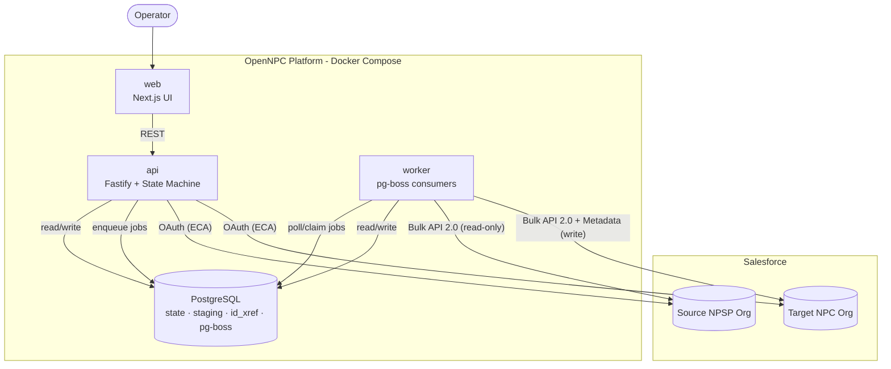
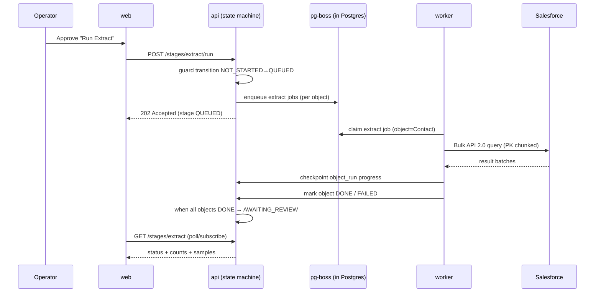

# 03 · Architecture

[← Scope & Personas](02-scope-and-personas.md) · [Index](README.md) · Next: [Migration Workflow →](04-migration-workflow.md)

---

## 1. Overview

OpenNPC is a self-hostable application made of **three Node.js processes** sharing **one PostgreSQL
database**. It connects to a source NPSP org and a target NPC org over the Salesforce APIs. There is
no Redis, no external queue service, and nothing installed inside Salesforce beyond an External
Client App registration for OAuth.



## 2. Components

### `web` — Next.js UI
- Project setup, connect-org screens, readiness report, **mapping editor**, per-stage dashboards
  with live progress, review/approve gates, error drill-down, reconciliation report.
- Talks only to `api` over REST; holds no Salesforce credentials.

### `api` — Fastify service (the controller)
- REST endpoints (projects, connections, stages, mappings, reviews, errors, reports).
- Hosts the **state-machine controller**: validates stage transitions, enforces review gates,
  enqueues jobs into pg-boss.
- Handles the **OAuth callbacks** for the External Client App flow and stores encrypted tokens.
- Does **not** run heavy Salesforce batch work itself — it delegates to the worker.

### `worker` — pg-boss consumers (the muscle)
- Long-running, resumable jobs: Bulk API extract, transform passes, Bulk API load, validation.
- Checkpoints progress per object to the database so a restart resumes mid-object.
- Scales horizontally — run N worker containers; pg-boss distributes jobs.

### PostgreSQL — the single source of truth
- Migration state (`stage_run`, `object_run`), staging data, the `id_xref` cross-reference,
  mapping definitions, and errors. pg-boss creates its own queue tables in a dedicated schema.
- See [06-database-schema.md](06-database-schema.md).

## 3. Why this shape

| Decision | Rationale |
|----------|-----------|
| Split `api` vs `worker` | Keep the UX responsive while multi-hour Bulk jobs run; restart workers without dropping the API. |
| **pg-boss** instead of BullMQ/Redis | Durable, retrying job queue **using PostgreSQL only** — one less piece of infra to host (the user has no Redis). |
| DB-backed state machine | The "restartable, rerun one stage, review gate" requirement is fundamentally about durable state; Postgres holds it. |
| jsforce | Most mature Salesforce client for Node: Bulk API 2.0, OAuth, Metadata/Tooling, describe. |
| Prisma | Typed schema + migrations for the relational model and `id_xref`. |
| Monorepo (pnpm) | Share `salesforce`, `mapping`, `core`, `db` packages across `api` and `worker`. |

## 4. Technology stack

| Concern | Choice | Notes |
|---------|--------|-------|
| Runtime | Node.js 20 LTS | |
| Language | TypeScript (strict) | Shared types across web/api/worker |
| Salesforce client | jsforce v3 | Bulk API 2.0, OAuth, Metadata, Tooling, describe |
| Database | PostgreSQL 15+ | State, staging, `id_xref`, queue |
| Queue | pg-boss | Postgres-backed; retries, backoff, scheduling |
| ORM | Prisma | Migrations + typed access |
| API framework | Fastify | Fast, schema-validated REST |
| Web | Next.js (App Router) + React | UI + thin BFF if needed |
| Validation | Zod | Request + mapping-definition validation |
| Auth (orgs) | OAuth 2.0 Authorization Code + PKCE via **External Client App** | Connected Apps are deprecated |
| Auth (app users) | Session/JWT (configurable) | Multi-tenant SaaS optional; self-host single-tenant default |
| Crypto | AES-256-GCM (Node `crypto`) | Encrypt refresh tokens at rest |
| Packaging | pnpm workspaces + Docker Compose | Single-command self-host |
| Diagrams/docs | Markdown + Mermaid | |

> **Correction vs the ChatGPT thread:** that outline proposed Python/Pandas + CSV + SQLite +
> GitHub Actions. We standardize on **Node/TS + jsforce + PostgreSQL + pg-boss** because (a) jsforce
> is the strongest Salesforce client, (b) one language across UI/API/worker, and (c) a durable
> Postgres-backed queue + DB state machine directly delivers the restartable behavior the product
> requires. CSV/SQLite are replaced by Postgres staging tables; GitHub Actions is not the runtime
> orchestrator (it can still be used for CI).

## 5. Deployment topology (self-host)

`docker-compose.yml` services:

```
postgres   → data volume; the only stateful dependency
api        → depends_on postgres; exposes :3001
worker     → depends_on postgres; no exposed port; scale: N
web        → depends_on api; exposes :3000
```

- **Single command:** `docker compose up -d` brings up the whole platform.
- **Config via env:** database URL, app encryption key, External Client App client IDs/secrets and
  redirect URIs, concurrency/batch-size tuning.
- **Scaling:** increase `worker` replicas for throughput; Postgres is the coordination point.
- **Backups:** a single Postgres backup captures all migration state, staging, and `id_xref`.

## 6. Runtime flow (happy path)



See [10-api-and-jobs.md](10-api-and-jobs.md) for the job model and [04-migration-workflow.md](04-migration-workflow.md)
for the full state machine.
