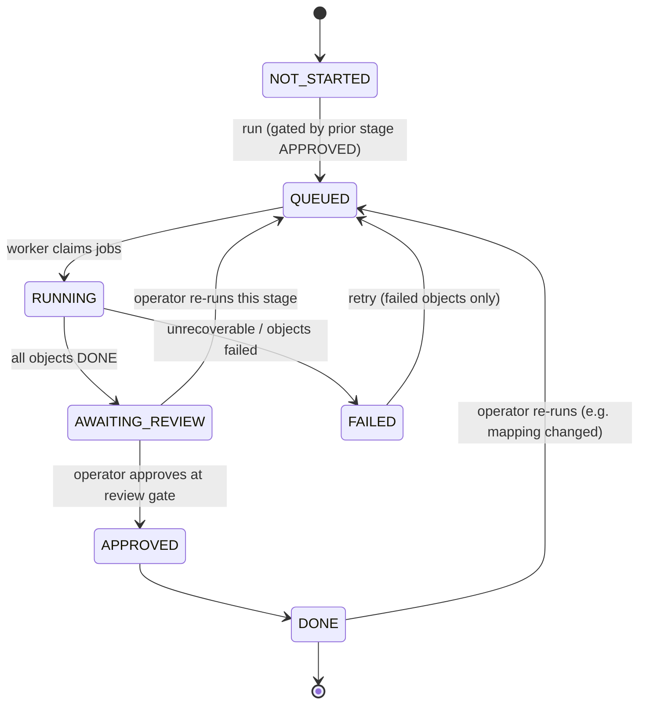
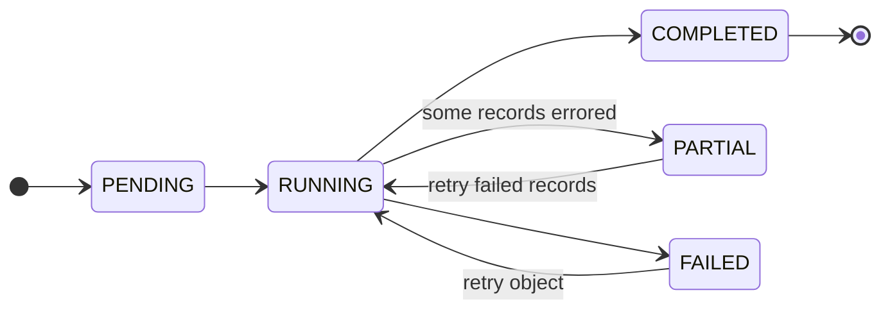
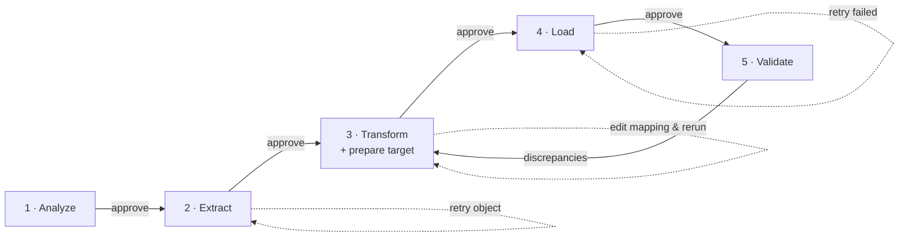

# 04 · Migration Workflow — The Durable State Machine

[← Architecture](03-architecture.md) · [Index](README.md) · Next: [Data-Model Mapping →](05-data-model-mapping.md)

---

> This is the core of the product. The migration is **not** a linear wizard that runs 1→2→3→4→5 and
> dies on the first error. It is a **durable state machine** where each stage persists its own
> progress, is restartable after failure, pauses for human review, and can be re-run in isolation.

## 1. The five stages

| # | Stage | Purpose | Source reads | Target writes |
|---|-------|---------|:---:|:---:|
| 1 | **Analyze** | Connect both orgs, discover schemas, count records, detect NPSP config & customizations, auto-draft the mapping, produce a readiness report. Optionally provision target external-ID fields. | ✅ (read-only) | ⚠️ schema only (ext-ID fields) |
| 2 | **Extract** | Bulk API 2.0 query each in-scope source object into Postgres staging. PK chunking for large objects. | ✅ (read-only) | ❌ |
| 3 | **Transform** | Apply mapping rules to convert NPSP staging → NPC-shaped staging; build the `id_xref`; run validations; **prepare target schema** (record types, picklists, fields). | ❌ | ⚠️ schema only |
| 4 | **Load** | Bulk API 2.0 **upsert** into NPC in dependency order, keyed on external IDs; two-pass for circular refs; capture new NPC IDs into `id_xref`. | ❌ | ✅ (data) |
| 5 | **Validate** | Reconcile counts/financial totals, spot-check records, trigger NPC rollups, produce the migration report. | ✅ (read-only) | ⚠️ rollup trigger only |

> Stage 1 merges "Connect" and "Assess". **Target-schema preparation lives in Stage 3** — this is
> the corrected version of the ChatGPT outline's flawed "deploy NPSP metadata into NPC" step. We do
> not clone NPSP's managed-package metadata; we *prepare* the NPC org to receive the data.

## 2. Stage status model

Each stage (a row in `stage_run`) moves through this status machine:

Key rules:
- **No automatic stage→stage jump.** A stage can only start when the previous stage is `APPROVED`.
  Moving from `AWAITING_REVIEW` to `APPROVED` is an explicit human action (the review gate).
- A stage can be re-run from `DONE` or `AWAITING_REVIEW` (e.g. you edited the mapping and want to
  re-transform). Re-running is safe because of idempotent upserts (see §5).

## 3. Per-object sub-status (why 300k records is survivable)

Within a stage, **every object gets its own `object_run` row** (e.g. Extract→Contact,
Extract→Opportunity). Each tracks `status`, processed/failed counts, the Bulk `job_id`, and a
`checkpoint`. This granularity is what makes large migrations recoverable:

- If `Opportunity` extract fails but `Contact` succeeded, you **retry only `Opportunity`**.
- If the worker dies mid-load on object N, it resumes from the saved checkpoint/`job_id` — it does
  not restart the object from zero, and it never re-creates already-loaded records.

## 4. Review gates

Every stage ends in `AWAITING_REVIEW` and surfaces a **gate artifact** the operator must approve:

| Stage | Review-gate artifact |
|-------|----------------------|
| Analyze | Readiness report + the **editable draft mapping** |
| Extract | Per-object record counts + sample rows |
| Transform | Transformed samples + validation/error report + the target-schema change plan |
| Load | Success/failure counts + per-record error report |
| Validate | Reconciliation report (counts, totals, discrepancies) |

Approval is recorded (who/when) for auditability. The operator may instead choose **Re-run** (back
to `QUEUED`) — e.g. after editing the mapping in the Analyze gate.

## 5. Idempotent, restartable loads (the linchpin pattern)

To make "re-run a stage without duplicating data" safe:

1. During **Analyze/Transform**, the platform provisions a custom external-ID text field on each
   target NPC object — e.g. `Legacy_NPSP_Id__c` (External ID, Unique) — via the Metadata API.
2. Every transformed record carries its **original NPSP Id** in that field.
3. **Load uses Bulk API 2.0 `upsert` keyed on `Legacy_NPSP_Id__c`**, not `insert`.

Consequences:
- Re-running Load **updates** existing records instead of creating duplicates.
- A worker crash mid-load is harmless: re-running upserts the same rows again with no side effects.
- The external ID doubles as the **reconciliation key** and an audit trail back to the source.

## 6. Resumability mechanics

| Failure | Recovery |
|---------|----------|
| Worker process restarts mid-job | pg-boss redelivers the job; the object resumes from its `checkpoint`/Bulk `job_id`. |
| One object fails, others succeed | Stage goes `FAILED`; operator retries **only** the failed `object_run`. |
| Some records in an object error | Object goes `PARTIAL`; errors land in `migration_error` (retryable); operator retries just those. |
| Operator edits mapping after Load | Re-run Transform → Load; upserts apply changes with no duplicates. |
| Bulk job exceeds API limits | Worker throttles/backs off (pg-boss retry with backoff); resumes when limits reset. |

## 7. Transitions API (conceptual)

The `api` exposes guarded transitions; the worker never changes stage status directly except via
these (it reports object-level results, the controller derives stage status):

- `POST /projects/:id/stages/:stage/run` — guard: prior stage `APPROVED`; effect: `→ QUEUED`, enqueue jobs.
- `POST /projects/:id/stages/:stage/approve` — guard: `AWAITING_REVIEW`; effect: `→ APPROVED → DONE`.
- `POST /projects/:id/stages/:stage/retry` — guard: `FAILED`/`PARTIAL`; effect: re-enqueue failed objects.
- `POST /projects/:id/objects/:objectRunId/retry` — retry a single object.

See [10-api-and-jobs.md](10-api-and-jobs.md) for the full surface.

## 8. End-to-end stage flow

The dashed arrows are the point of the whole design: any stage can loop on itself, and Validate can
send you back to Transform to fix mappings — all without redoing the stages that already succeeded.
