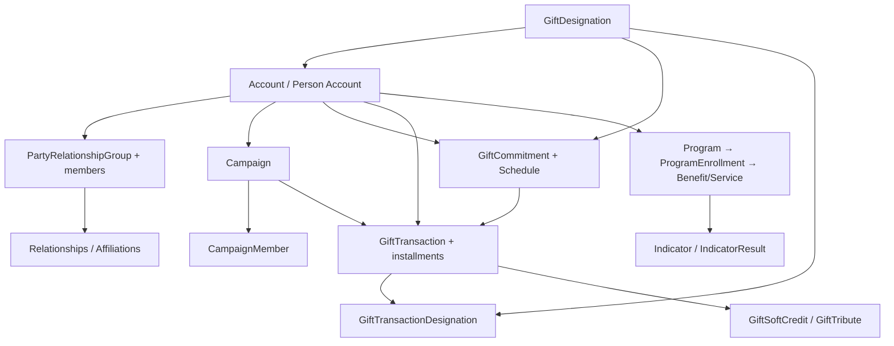

# 05 · Data-Model Mapping (NPSP → NPC)

[← Migration Workflow](04-migration-workflow.md) · [Index](README.md) · Next: [Database Schema →](06-database-schema.md)

---

This is the heart of the product: translating the **NPSP managed-package, Household-Account data
model** into the **NPC standard-object, Person-Account / Party data model**, and re-pointing every
relationship.

> ⚠️ **NPC API names evolve and orgs customize.** Treat every NPC object/field name below as a
> **sensible default that the Analyze stage confirms against the live target-org schema**. Any name
> that cannot be resolved at runtime is flagged as a **blocking validation error** before Load — the
> platform never blindly writes to a guessed field. Mappings ship as editable definition files (see
> [08-transformation-engine.md](08-transformation-engine.md)), not hardcoded logic.
>
> 📌 **This document describes the intended target model, not entirely what is built.** It was written
> before the build and several object names in it were later found to be wrong against a real NPC org
> (corrections are marked ⚠️ inline). For the **verified, evidence-based** object map and the honest
> delivered-vs-planned status, see
> **[planning_for_migration/01-npsp-npc-object-map.md](planning_for_migration/01-npsp-npc-object-map.md)**.
> Where the two disagree, that one is correct.

## 1. The ID re-pointing problem and `id_xref`

Every record gets a **new Salesforce Id** in the target org, so old lookups are meaningless there.
The platform maintains a central cross-reference table, `id_xref`:

```
(project_id, source_object, source_id) → (target_object, target_id, legacy_ext_id)
```

- Populated during **Transform** (source_id known) and completed during **Load** (target_id returned
  by Bulk API).
- Every lookup field is resolved through `id_xref` so a child record points at the *new* parent Id.
- The `legacy_ext_id` (the original NPSP Id, stored in `Legacy_NPSP_Id__c` on the target) makes loads
  idempotent and gives reconciliation a join key.

## 2. NPSP namespaces you'll encounter (source)

| Namespace | Meaning |
|-----------|---------|
| `npsp__` | Core NPSP (Allocations, GAUs, Addresses, Levels, Soft Credits, Engagement Plans) |
| `npe01__` | Contacts & Organizations / Payments (`npe01__OppPayment__c`) |
| `npe03__` | Recurring Donations (`npe03__Recurring_Donation__c`) |
| `npe4__` | Relationships (`npe4__Relationship__c`) |
| `npe5__` | Affiliations (`npe5__Affiliation__c`) |
| `npo02__` | Household rollup fields on Contact/Account |
| `pmdm__` | NPSP Program Management Module (optional; source for Programs) |

## 3. Core fundraising mapping

### 3.1 Constituents (the biggest model shift)

NPSP uses the **Household Account model**: each Contact belongs to a Household `Account`. NPC uses
**Person Accounts** (a unified Account+Contact) plus Party relationship groups for households.

| NPSP source | → | NPC target | Transform notes |
|-------------|---|------------|-----------------|
| `Contact` + its Household `Account` | → | **Person Account** | Merge the Contact and its 1-person Household into a single Person Account. Carry name, birthdate, email, phones, addresses. |
| `Account` (Household, multi-member) | → | **`PartyRelationshipGroup`** (+ members) | Multi-person households become a relationship group; each member is a Person Account joined via **`PartyRoleRelation`**. ⚠️ There is no `PartyRelationshipGroupMember` object (verified against a real NPC org). |
| `Account` (Organization / Business) | → | **Business `Account`** | Mostly direct field mapping; record type → NPC business account type. |
| `npsp__Address__c` | → | Person Account address / `ContactPointAddress` | Address objects become standard address fields or contact points; seasonal/secondary addresses → contact points. |

Field examples (constituent):

| NPSP field | → | NPC field |
|------------|---|-----------|
| `Contact.FirstName` / `LastName` | → | PersonAccount `FirstName` / `LastName` |
| `Contact.Birthdate` | → | PersonAccount `PersonBirthdate` |
| `Contact.npe01__Preferred_Email__c` | → | PersonAccount `PersonEmail` (preferred) + `ContactPointEmail` for others |
| `Contact.npe01__PreferredPhone__c` | → | resolved preferred `Phone` + `ContactPointPhone` for others |
| `Account.Name` (Org) | → | `Account.Name` |

### 3.2 Donations → Gift Transactions

NPSP models a donation as an `Opportunity` with one or more `npe01__OppPayment__c` records. NPC's
**`GiftTransaction`** unifies the donation and its payment(s).

| NPSP source | → | NPC target | Transform notes |
|-------------|---|------------|-----------------|
| `Opportunity` (Closed Won donation) | → | **`GiftTransaction`** | Map amount, close/transaction date, stage→status, payment method, donor (Person Account via `id_xref`), campaign. |
| `npe01__OppPayment__c` | → | **Gift payment / installment** | One Opp with N payments → either N installment records under the GiftTransaction or split per policy (configurable). Paid vs written-off vs scheduled status carried over. |
| `Opportunity` (Pledge / open) | → | **Outstanding gift / pledge** | Open pledges map to the NPC pledge/installment construct with remaining balance. |
| `OpportunityContactRole` | → | **donor / role linkage + soft credits** | Primary donor sets the gift's account; non-primary roles become soft credits (below). |

Field examples (gift):

| NPSP field | → | NPC field |
|------------|---|-----------|
| `Opportunity.Amount` | → | `GiftTransaction.Amount` (or `OriginalAmount`) |
| `Opportunity.CloseDate` | → | `GiftTransaction.TransactionDate` |
| `Opportunity.StageName` | → | `GiftTransaction.Status` (value-mapped) |
| `Opportunity.CampaignId` | → | `GiftTransaction.CampaignId` (via `id_xref`) |
| `npe01__OppPayment__c.npe01__Payment_Amount__c` | → | installment `Amount` |
| `npe01__OppPayment__c.npe01__Paid__c` | → | installment `Status` (Paid/Unpaid) |

### 3.3 Recurring Donations → Gift Commitments

| NPSP source | → | NPC target | Transform notes |
|-------------|---|------------|-----------------|
| `npe03__Recurring_Donation__c` | → | **`GiftCommitment`** | The ongoing commitment/pledge. Map donor, amount, designation, status. |
| RD schedule (Enhanced RD `RecurringDonationSchedule`, or classic period/installment fields) | → | **`GiftCommitmentSchedule`** | Handle **both** classic and Enhanced Recurring Donations — schedule shape differs; detect during Analyze. |
| RD-generated Opportunities | → | `GiftTransaction`s linked to the commitment | Each generated installment gift references its `GiftCommitment`. |

### 3.4 Designations & allocations

| NPSP source | → | NPC target | Transform notes |
|-------------|---|------------|-----------------|
| `npsp__General_Accounting_Unit__c` (GAU) | → | **`GiftDesignation`** | Funds/purposes. Active flag, name, description. ⚠️ The NPC object is `GiftDesignation`; a plain `Designation` object does **not** exist (verified against a real NPC org). |
| `npsp__Allocation__c` | → | **`GiftTransactionDesignation`** (or `GiftDefaultDesignation` for commitments) | Re-point **both** the gift Id and the designation Id via `id_xref`. Percentage vs fixed-amount allocations preserved. |

### 3.5 Soft credits, tributes, levels

| NPSP source | → | NPC target |
|-------------|---|------------|
| `npsp__Partial_Soft_Credit__c` + soft-credit `OpportunityContactRole` | → | **`GiftSoftCredit`** |
| Tribute fields (`npsp__In_Honor_Of__c`, `npsp__In_Memory_Of__c`, Tribute object) | → | **`GiftTribute`** |
| `npsp__Level__c` | → | ⚠️ **no NPC equivalent** — `GivingTier` does **not** exist (verified). Decide per project: a custom field on the Person Account, or skip. |
| `npsp__Engagement_Plan__c` / `npsp__Engagement_Plan_Task__c` | → | Tasks/Activities (or Program tasks if PMM in scope) |

## 4. Relationships & affiliations

| NPSP source | → | NPC target | Notes |
|-------------|---|------------|-------|
| `npe4__Relationship__c` (person↔person) | → | NPC party relationship junction (confirm exact object in Analyze) | Reciprocal pairs deduplicated; relationship type value-mapped. |
| `npe5__Affiliation__c` (person↔org) | → | `AccountContactRelation` / party affiliation | Role, primary flag, status carried over. |
| Household membership (multi-member) | → | `PartyRelationshipGroup` + **`PartyRoleRelation`** | Built from the Household Account → members. |

## 5. Campaigns & engagement

`Campaign` and `CampaignMember` are **standard objects in both** NPSP and NPC, so this is largely a
**pass-through with field mapping** rather than a model transform.

| NPSP source | → | NPC target | Notes |
|-------------|---|------------|-------|
| `Campaign` | → | `Campaign` | Direct; re-point parent campaign via `id_xref`. |
| `CampaignMember` | → | `CampaignMember` | Re-point Campaign + Contact/Lead (now Person Account) via `id_xref`. |

## 6. Programs & outcomes *(only if PMM installed)*

NPSP core has **no** program management. If the source has the **Program Management Module**
(`pmdm__`), map into NPC Program Management / Outcome Management:

| NPSP PMM source | → | NPC target |
|-----------------|---|------------|
| `pmdm__Program__c` | → | `Program` |
| `pmdm__ProgramEngagement__c` | → | `ProgramEnrollment` |
| `pmdm__Service__c` | → | `Benefit` / `Service` |
| `pmdm__ServiceDelivery__c` | → | `BenefitDisbursement` / `ServiceSession` |
| Cohorts | → | `ProgramCohort` |
| Outcome indicators | → | `Indicator`, `IndicatorAssignment`, `IndicatorResult` |

If PMM is not installed, this scope is a no-op (the Analyze stage reports it as "not present").

## 7. Load dependency order

Parents must exist before children so lookups resolve. The loader (see
[04-migration-workflow.md](04-migration-workflow.md)) writes in this order:



### Two-pass for circular references
Some references are circular (e.g. an Account's primary Contact, or a relationship's reciprocal
pointer). The loader does a **second update pass** after both sides exist, resolving the remaining
lookups via `id_xref`.

## 8. Value mapping (picklists & record types)

Beyond field-to-field mapping, the engine applies **value maps**:

- **Picklist translation** — e.g. NPSP `Opportunity.StageName` values → NPC `GiftTransaction.Status`
  values.
- **Record type mapping** — NPSP record types → NPC record types (must exist in target; provisioned
  during target-schema prep).
- **Owner / User mapping** — owner IDs differ across orgs; a user `id_xref` (built during Analyze
  from a username/email match) re-points `OwnerId`. Unmatched owners fall back to a configurable
  default user.

## 9. Things that require an explicit business decision

The Analyze stage surfaces these for the operator to decide (no silent defaults for money-affecting
choices):

- How to split a multi-payment Opportunity (single gift + installments vs multiple gifts).
- How to treat open pledges and write-offs.
- Household consolidation rules (which contact is "primary"; deduplication strategy).
- Mapping of custom NPSP fields/objects with no standard NPC home (custom field on target, or skip).
- Picklist values present in source but absent in target (create vs remap vs reject).
