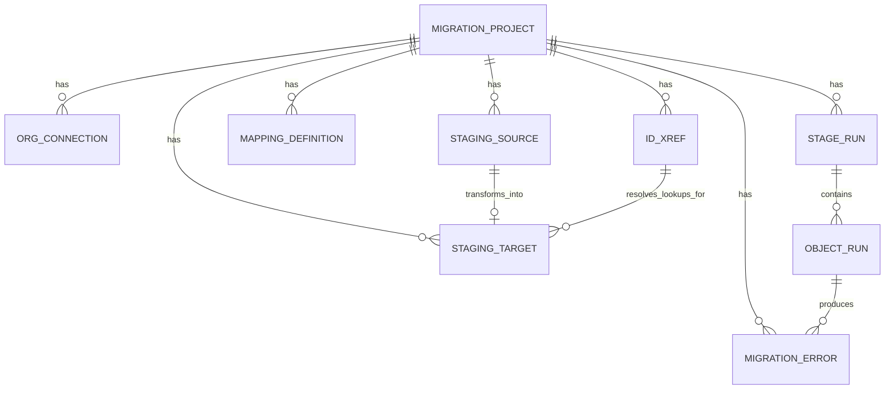

# 06 · Database Schema

[← Data-Model Mapping](05-data-model-mapping.md) · [Index](README.md) · Next: [Salesforce Integration →](07-salesforce-integration.md)

---

PostgreSQL is the single source of truth: migration state, staging data, the ID cross-reference,
mappings, errors, and the pg-boss job queue. Defined and migrated with **Prisma**.

## 1. Entity-relationship overview

## 2. Tables

### `migration_project`
The top-level container for one NPSP→NPC migration.

| Column | Type | Notes |
|--------|------|-------|
| `id` | uuid PK | |
| `name` | text | |
| `scope` | jsonb | which scopes enabled (core, relationships, programs, campaigns) |
| `status` | text | active / completed / archived |
| `created_at` / `updated_at` | timestamptz | |

### `org_connection`
A connected Salesforce org (one source, one target per project).

| Column | Type | Notes |
|--------|------|-------|
| `id` | uuid PK | |
| `project_id` | uuid FK | |
| `role` | enum | `source` \| `target` |
| `instance_url` | text | |
| `org_id` | text | Salesforce org id |
| `api_version` | text | |
| `access_token_enc` | bytea | **encrypted** (AES-256-GCM) |
| `refresh_token_enc` | bytea | **encrypted** |
| `token_meta` | jsonb | issued_at, scope, etc. (no secrets) |

> Tokens are encrypted at rest; see [12-security.md](12-security.md). Never store plaintext tokens.

### `stage_run`
One row per stage per project (history kept by `attempt`).

| Column | Type | Notes |
|--------|------|-------|
| `id` | uuid PK | |
| `project_id` | uuid FK | |
| `stage` | enum | `analyze`\|`extract`\|`transform`\|`load`\|`validate` |
| `status` | enum | `NOT_STARTED`\|`QUEUED`\|`RUNNING`\|`AWAITING_REVIEW`\|`APPROVED`\|`DONE`\|`FAILED` |
| `attempt` | int | increments on re-run |
| `stats` | jsonb | counts, durations, summary |
| `error` | text | last error summary |
| `approved_by` / `approved_at` | text / timestamptz | review-gate audit |
| `started_at` / `finished_at` | timestamptz | |

### `object_run`
Per-object granularity within a stage — **the key to isolated re-runs**.

| Column | Type | Notes |
|--------|------|-------|
| `id` | uuid PK | |
| `stage_run_id` | uuid FK | |
| `object_api_name` | text | e.g. `Opportunity`, `GiftTransaction` |
| `status` | enum | `PENDING`\|`RUNNING`\|`COMPLETED`\|`PARTIAL`\|`FAILED` |
| `processed_count` / `failed_count` | int | |
| `bulk_job_id` | text | Salesforce Bulk API job id (for resume) |
| `checkpoint` | jsonb | locator/offset to resume mid-object |
| `started_at` / `finished_at` | timestamptz | |

### `mapping_definition`
The editable NPSP→NPC mapping; the auto-draft is version 1.

| Column | Type | Notes |
|--------|------|-------|
| `id` | uuid PK | |
| `project_id` | uuid FK | |
| `object` | text | source object the mapping is for |
| `field_map` | jsonb | source field → target field |
| `value_map` | jsonb | picklist/record-type/value translations |
| `options` | jsonb | per-object transform options (e.g. payment-split policy) |
| `version` | int | |
| `approved_by` / `approved_at` | text / timestamptz | |

### `staging_source`
Raw extracted source records. Start with one wide table + JSONB; split per-object only if profiling
demands it.

| Column | Type | Notes |
|--------|------|-------|
| `id` | bigserial PK | |
| `project_id` | uuid FK | |
| `object` | text | source object |
| `source_id` | text | Salesforce 18-char Id |
| `raw` | jsonb | full source record |
| `extract_run_id` | uuid | which `object_run` produced it |

Indexes: `(project_id, object)`, `(project_id, source_id)`, GIN on `raw` if you query into it.

### `staging_target`
Transformed, NPC-shaped records ready to load.

| Column | Type | Notes |
|--------|------|-------|
| `id` | bigserial PK | |
| `project_id` | uuid FK | |
| `target_object` | text | e.g. `GiftTransaction` |
| `transformed` | jsonb | NPC-shaped payload (with `Legacy_NPSP_Id__c`) |
| `source_ref` | text | originating source_id |
| `load_status` | enum | `pending`\|`loaded`\|`error` |
| `target_id` | text | populated after Load |
| `error` | text | last load error |

### `id_xref` — the central remapping table
| Column | Type | Notes |
|--------|------|-------|
| `id` | bigserial PK | |
| `project_id` | uuid FK | |
| `source_object` | text | |
| `source_id` | text | **unique with project_id** |
| `target_object` | text | |
| `target_id` | text | filled at Load time |
| `legacy_ext_id` | text | value written to `Legacy_NPSP_Id__c` on target |

Unique index: `(project_id, source_id)`. Lookup index: `(project_id, source_object, source_id)`.

### `migration_error`
Every per-record failure, retryable or not.

| Column | Type | Notes |
|--------|------|-------|
| `id` | bigserial PK | |
| `project_id` | uuid FK | |
| `object_run_id` | uuid FK | |
| `stage` | text | |
| `object` | text | |
| `source_id` | text | |
| `message` | text | Salesforce/validation error |
| `payload` | jsonb | the offending record (PII-aware logging) |
| `retryable` | bool | |
| `created_at` | timestamptz | |

### pg-boss tables
Created and managed by **pg-boss** in its own schema (`pgboss`). Holds the durable job queue:
pending/active/completed/failed jobs, retries, backoff, and scheduling. Not hand-modeled.

## 3. Volume & indexing notes

- For very large orgs (100k–1M+ records), `staging_source`/`staging_target` are the hot tables.
  Partition by `(project_id, object)` if a single project's volume warrants it.
- Keep `id_xref` lean and well-indexed — it is hit on every lookup resolution during Transform/Load.
- Use bulk `COPY`/batched inserts when writing staging from extract results; avoid row-by-row.
- TTL/cleanup: provide an "archive project" action that drops staging tables for a completed project
  while retaining `stage_run`, `object_run`, `id_xref`, and `migration_error` for audit.

## 4. Why Postgres (not CSV/SQLite)

The ChatGPT outline stored extracted data as CSV files and ID mapping in SQLite. We use Postgres
staging tables instead because the platform needs **transactional updates, concurrent worker
access, indexed lookup of `id_xref`, durable per-object checkpoints, and the pg-boss queue** — all
in one place, all backed up together. CSV/SQLite cannot safely support concurrent resumable workers.
