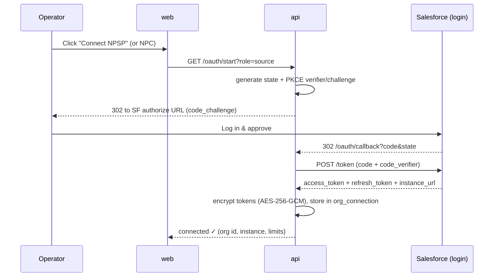
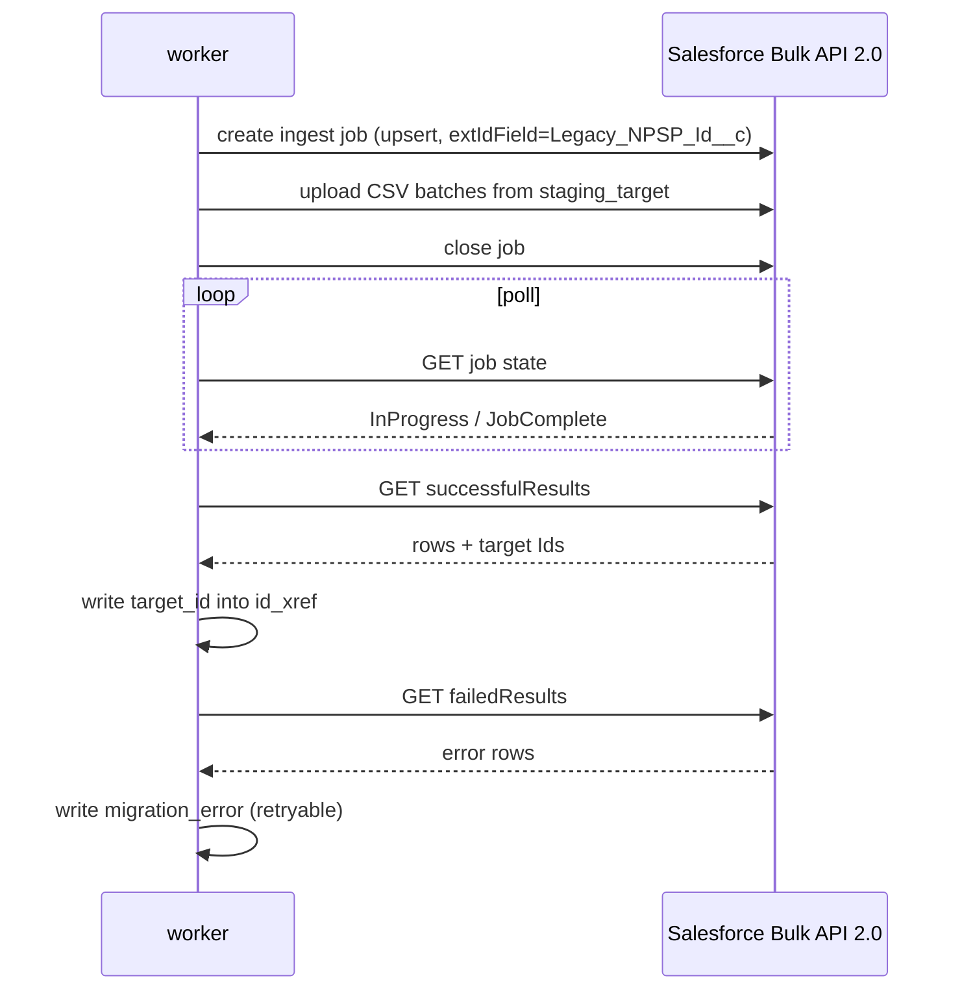

# 07 · Salesforce Integration

[← Database Schema](06-database-schema.md) · [Index](README.md) · Next: [Transformation Engine →](08-transformation-engine.md)

---

All Salesforce access goes through the `packages/salesforce` package (a thin, typed wrapper over
**jsforce v3**). Four concerns: **auth**, **bulk data**, **schema discovery**, and **target-schema
preparation**.

## 1. Authentication — OAuth via External Client App (ECA)

> **Connected Apps are deprecated.** OpenNPC uses **External Client Apps** for OAuth. The OAuth flow
> itself — Authorization Code + PKCE — is unchanged; only the in-Salesforce app definition differs.

### Setup (one-time, per platform deployment)
1. In each org (or a packaging org), create an **External Client App** with OAuth enabled.
2. Scopes: `api`, `refresh_token`, `offline_access` (read source / write target).
3. Redirect URI → `https://<your-host>/api/oauth/callback`.
4. Store the client id/secret in the platform's environment config.

### Connect flow (per org, in the UI)

- **PKCE** protects the code exchange.
- Only `refresh_token` is kept long-term (encrypted); access tokens are short-lived and refreshed on
  demand by the jsforce connection wrapper.
- Optional **JWT Bearer** flow can be added later for headless/scheduled runs (ECA + certificate).

## 2. Bulk data — Bulk API 2.0

Used for both **extract** (query) and **load** (ingest/upsert). jsforce exposes Bulk API 2.0; the
wrapper adds checkpointing and error capture.

### Extract (query)
- Issue a Bulk API 2.0 **query job** per object with a generated SOQL `SELECT` of mapped fields.
- For large objects, use **PK chunking** so Salesforce splits the query by record-Id ranges; the
  worker streams result batches into `staging_source`.
- Persist the Bulk `job_id` and a locator in `object_run.checkpoint` so a restart resumes streaming
  rather than re-querying from zero.

### Load (ingest, upsert)
- Issue Bulk API 2.0 **ingest jobs** with operation **`upsert`** keyed on `Legacy_NPSP_Id__c`.
- This makes loads **idempotent** — re-running never duplicates (see
  [04-migration-workflow.md](04-migration-workflow.md) §5).
- Poll job status; on completion fetch **successful results** (capture returned target Ids into
  `id_xref`) and **failed results** (write to `migration_error`, mark retryable where appropriate).
- Respect batch sizing and API limits; back off and resume via pg-boss retry.

## 3. Schema discovery — Metadata & Tooling / describe

During **Analyze**, the wrapper reads both orgs' schemas to drive the mapping and validate it:

- `describeGlobal` + `describe(object)` to enumerate objects, fields, types, picklist values,
  record types, and relationships.
- Detect **NPSP configuration**: account model (Household / 1×1 / Bucket), whether **Enhanced
  Recurring Donations** is enabled, installed packages (incl. PMM `pmdm__`), custom fields.
- Confirm the **target** org has the expected NPC objects/fields. **Unresolved target names become
  blocking validation errors** — the platform never writes to a guessed field.
- Record counts per object (`SELECT COUNT()` or Bulk) to size the migration and surface API-limit
  risk in the readiness report.

## 4. Target-schema preparation

> This replaces the ChatGPT outline's incorrect "deploy NPSP managed-package metadata into NPC"
> step. We **prepare** the NPC org to receive data; we do **not** clone NPSP's objects/flows.

Performed in **Transform** (with a review gate showing the change plan), via the Metadata API:

- **External-ID fields** — create `Legacy_NPSP_Id__c` (External ID, Unique, Text) on each target
  object that will receive records. This enables idempotent upserts and reconciliation.
- **Record types** — ensure target record types referenced by the mapping exist.
- **Picklist values** — ensure target picklists contain the mapped values (or the mapping remaps
  them).
- **Custom fields** — for NPSP custom fields the operator chooses to carry over, create matching
  custom fields on the target object.

Idempotent: prepare-target checks existence first (create-if-missing), so re-running is safe.

## 5. Person Accounts & org prerequisites

- The target org must have **Person Accounts enabled** (a one-way org setting) and **Nonprofit Cloud
  (Fundraising)** provisioned. The Analyze stage verifies this and **blocks** if not — loading
  constituents as Person Accounts is impossible otherwise.
- Verify the integration user has the permission sets/licenses required to write NPC objects.

## 6. API limits & throughput

- Surface in the readiness report: daily Bulk API limits, concurrent job limits, and the org's
  record volume vs. those limits.
- The worker throttles concurrency and batch sizes (configurable); pg-boss retry-with-backoff
  handles transient `REQUEST_LIMIT_EXCEEDED`.
- Bulk job results are retained ~24h by Salesforce — the worker fetches results promptly and
  persists them so nothing is lost if a job result expires before a late retry.

## 7. The `packages/salesforce` surface (conceptual)

| Module | Responsibility |
|--------|----------------|
| `auth.ts` | ECA OAuth (Authorization Code + PKCE), token refresh, encrypted token store, jsforce connection factory |
| `bulk2.ts` | Bulk API 2.0 query (PK chunking) + ingest/upsert with checkpointing & result capture |
| `schema.ts` | `describe`/Tooling reads, NPSP-config detection, target-name resolution |
| `metadata.ts` | Target-schema prep (create ext-ID fields, record types, picklist values, custom fields) |
| `limits.ts` | Read & report org API limits |
