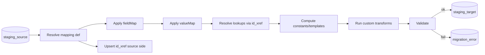

# 08 · Transformation Engine

[← Salesforce Integration](07-salesforce-integration.md) · [Index](README.md) · Next: [Validation & Reporting →](09-validation-and-reporting.md)

---

The transformation engine turns raw NPSP records (`staging_source`) into NPC-shaped records
(`staging_target`), resolving relationships through `id_xref`. It is **configuration-driven**: the
rules live in editable mapping definitions, not hardcoded logic.

## 1. Mapping definitions

Default mappings ship as versioned YAML in `packages/mapping/defaults/*.yaml`. The Analyze stage
clones the relevant defaults into the project's `mapping_definition` rows (version 1), which the
operator edits in the UI.

```yaml
# packages/mapping/defaults/opportunity.yaml
source: Opportunity
target: GiftTransaction
recordTypeMap:
  Donation: Gift
  "Major Gift": Gift
fieldMap:
  Amount: Amount
  CloseDate: TransactionDate
  CampaignId: { ref: Campaign, via: id_xref }     # re-pointed lookup
  AccountId: { ref: Account, via: id_xref }
valueMap:
  StageName:                                       # picklist translation
    "Closed Won": Paid
    Pledged: Outstanding
    "Closed Lost": Cancelled
options:
  paymentSplit: installments    # installments | separate-gifts
constants:
  Legacy_NPSP_Id__c: "{{ source.Id }}"            # external id for idempotent upsert
```

A mapping definition has four parts:
- **`fieldMap`** — source field → target field; a field can be a plain copy or a `{ ref, via }`
  lookup resolved through `id_xref`.
- **`valueMap`** — per-field value translation (picklists, stages, record types).
- **`options`** — per-object transform behaviour (e.g. payment-split policy).
- **`constants` / templates** — computed values, including the `Legacy_NPSP_Id__c` external id.

## 2. Engine pipeline



Per record: load the object's mapping → map fields → translate values → resolve lookups → compute
constants → run any custom transform hook → validate → write `staging_target` (or
`migration_error`). The `id_xref` source side (source_object, source_id, legacy_ext_id) is written
here; the target_id is filled later at Load.

## 3. Built-in complex transforms

Some conversions are model changes, not field maps. These are first-class transform modules
(selected by the mapping's `target`/`options`):

| Transform | What it does |
|-----------|--------------|
| **Household → Person Account** | Merge a Contact + its single-member Household Account into one Person Account; multi-member households emit a `PartyRelationshipGroup` + members. Resolves the "primary contact" per configured rule. |
| **Opportunity + Payments → Gift** | Combine an Opportunity with its `npe01__OppPayment__c` rows into a `GiftTransaction` (+ installments) or split into separate gifts, per `options.paymentSplit`. |
| **Recurring Donation → Commitment** | Produce a `GiftCommitment` + `GiftCommitmentSchedule`, normalizing classic vs Enhanced RD schedule shapes. |
| **Allocation → GiftTransactionDesignation** | Re-point both gift and designation; preserve percentage vs fixed amount. |
| **Soft credits / tributes** | Derive `GiftSoftCredit` / `GiftTribute` from contact roles and tribute fields. |
| **Owner/User remap** | Translate `OwnerId` via the user `id_xref`, with a default-user fallback. |

Each transform is a pure function `(sourceRecords, ctx) → targetRecords` where `ctx` exposes
`id_xref` lookups, the mapping definition, and project options — making them unit-testable in
isolation.

## 4. Lookup resolution & ordering

- During Transform, a lookup like `AccountId → { ref: Account, via: id_xref }` resolves to the
  **source→target** mapping for that Account. Because target Ids don't exist until Load, the engine
  stores the **source_id reference** on the staging_target record and the loader substitutes the
  real `target_id` (or uses external-ID upsert relationships) at load time.
- Objects are transformed in dependency order so parent `id_xref` rows exist before children
  reference them.

## 5. Validation (pre-load)

Before a record is allowed into `staging_target` it passes validators:

- **Schema validation** — required target fields present; field types compatible (Zod schemas
  derived from the target `describe`).
- **Referential validation** — every lookup resolves to a known source/target via `id_xref`.
- **Value validation** — every `valueMap` output is a legal target picklist value.
- **Business rules** — e.g. a gift must have a donor; a designation allocation must not exceed 100%.

Failures become `migration_error` rows (retryable vs not) and appear in the Transform review gate so
the operator can fix the mapping and **re-run only Transform**.

## 6. Extensibility (plugins)

Contributors add support for new objects or custom logic without touching the core:

- **New mapping** — drop a YAML file in `packages/mapping/defaults/` (or a project override).
- **Custom transform** — register a transform module by `target` name; it implements the
  `(sourceRecords, ctx) → targetRecords` contract.
- **Custom validator** — register a validator hook keyed on object.

See [16-contributing.md](16-contributing.md) for the contribution workflow.

## 7. Determinism & repeatability

The engine is **pure and deterministic**: same `staging_source` + same `mapping_definition` →
identical `staging_target`. No wall-clock or random values leak into output (any needed timestamps
come from source data or are explicitly configured). This guarantees the "running twice produces the
same result" principle and makes re-running Transform after a mapping edit predictable.
