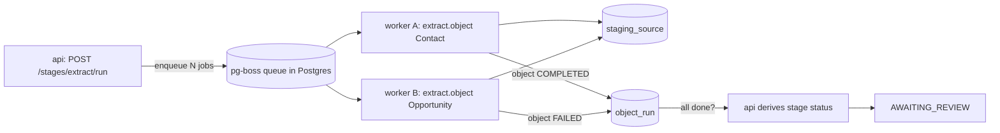

# 10 · API & Background Jobs

[← Validation & Reporting](09-validation-and-reporting.md) · [Index](README.md) · Next: [Frontend & UX →](11-frontend-ux.md)

---

The `api` (Fastify) exposes a REST surface to the UI and owns the **state-machine transitions**. The
heavy work runs as **pg-boss jobs** in the `worker`. The two communicate only through Postgres
(state tables + the pg-boss queue).

## 1. REST API surface

> Conventions: JSON; resource ids are UUIDs; long operations return `202 Accepted` and a stage/job
> reference to poll (or subscribe via SSE/WebSocket). All endpoints are project-scoped.

### Projects & connections
| Method | Path | Purpose |
|--------|------|---------|
| `POST` | `/projects` | Create a migration project |
| `GET` | `/projects/:id` | Project + all stage statuses |
| `GET` | `/oauth/start?projectId&role` | Begin ECA OAuth for source/target |
| `GET` | `/oauth/callback` | OAuth redirect handler (stores encrypted tokens) |
| `GET` | `/projects/:id/connections` | Connected orgs + health/limits |

### Analyze & mapping
| Method | Path | Purpose |
|--------|------|---------|
| `POST` | `/projects/:id/stages/analyze/run` | Run schema discovery + record counts + draft mapping |
| `GET` | `/projects/:id/analysis` | Readiness report |
| `GET` | `/projects/:id/mappings` | List mapping definitions |
| `GET` | `/projects/:id/mappings/:object` | One object's mapping |
| `PUT` | `/projects/:id/mappings/:object` | Edit a mapping (new version) |
| `POST` | `/projects/:id/mappings/validate` | Validate mappings against live target schema |

### Stage control (state machine)
| Method | Path | Purpose | Guard |
|--------|------|---------|-------|
| `POST` | `/projects/:id/stages/:stage/run` | Start a stage (enqueues jobs) | prior stage `APPROVED` |
| `POST` | `/projects/:id/stages/:stage/approve` | Approve the review gate | stage `AWAITING_REVIEW` |
| `POST` | `/projects/:id/stages/:stage/retry` | Re-enqueue failed objects | stage `FAILED`/`PARTIAL` |
| `GET` | `/projects/:id/stages/:stage` | Stage status, stats, object runs |
| `GET` | `/projects/:id/stages/:stage/sample` | Sample rows for the review gate |

### Objects, errors, reports
| Method | Path | Purpose |
|--------|------|---------|
| `GET` | `/projects/:id/objects/:objectRunId` | One object run's status/checkpoint |
| `POST` | `/projects/:id/objects/:objectRunId/retry` | Retry a single object |
| `GET` | `/projects/:id/errors?object&retryable` | Filterable error list |
| `POST` | `/projects/:id/errors/retry` | Retry a set of failed records |
| `GET` | `/projects/:id/report?format=html\|csv\|json` | Migration/reconciliation report |
| `GET` | `/projects/:id/events` | SSE stream of progress events |

## 2. Background-job model (pg-boss)

Each stage decomposes into **per-object jobs** so failures and retries are isolated.

| Job type | Payload | Produces |
|----------|---------|----------|
| `analyze.schema` | projectId, role | schema cache, NPSP-config detection |
| `analyze.counts` | projectId, object | record counts in `stage_run.stats` |
| `extract.object` | projectId, object | rows in `staging_source`; checkpoint |
| `transform.object` | projectId, object | rows in `staging_target`; `id_xref` source side; errors |
| `prepare.target` | projectId, object | ext-ID field/record type/picklist creation |
| `load.object` | projectId, object | upsert to NPC; `id_xref` target ids; errors |
| `load.secondpass` | projectId, object | resolve circular refs |
| `validate.reconcile` | projectId | reconciliation results + report data |

### Job properties
- **Idempotent** — re-running a job upserts (DB staging + Salesforce external-ID upsert), never
  duplicates.
- **Checkpointed** — `extract.object` / `load.object` persist a locator/`bulk_job_id` to
  `object_run.checkpoint`; on redelivery they resume, not restart.
- **Retryable with backoff** — pg-boss `retryLimit` + `retryBackoff` handle transient Salesforce
  errors (`REQUEST_LIMIT_EXCEEDED`, timeouts).
- **Concurrency-controlled** — per-object and global concurrency caps keep within API limits;
  configurable via env.
- **Singleton keys** — pg-boss singleton/`useSingletonKey` prevents two workers running the same
  object job concurrently.

## 3. Stage status derivation

The worker reports **object-level** results; the `api` derives **stage-level** status:

- all `object_run` `COMPLETED` → stage `AWAITING_REVIEW`
- any `object_run` `FAILED` (after retries) → stage `FAILED`
- mix of `COMPLETED` + `PARTIAL` → stage `AWAITING_REVIEW` with a warning (errors visible in gate)

This keeps the source of truth singular: the worker never writes stage status, only object results.

## 4. Events & progress

- `GET /projects/:id/events` streams Server-Sent Events: object started/progress/completed/failed,
  stage transitions. The UI shows live per-object progress bars without polling storms.
- Progress percentages come from `processed_count` vs the object's known total (from Analyze counts).

## 5. Error handling contract

- Salesforce per-record failures → `migration_error` (with `retryable`), surfaced in the gate.
- Job-level unrecoverable errors → object `FAILED`, pg-boss records the failure; operator retries.
- All errors carry enough context (object, source_id, message) to act on without reading logs;
  payloads are stored PII-aware (see [12-security.md](12-security.md)).
