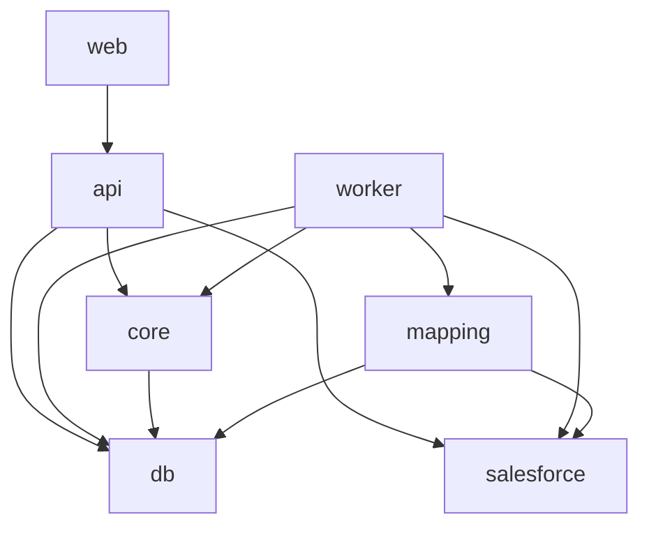

# 15 · Repository Structure

[← Testing Strategy](14-testing-strategy.md) · [Index](README.md) · Next: [Contributing →](16-contributing.md)

---

A **pnpm-workspaces monorepo**: three runnable apps share four internal packages, all in TypeScript.

## 1. Layout

```
npsp2npc/
├─ docker-compose.yml          # postgres + web + api + worker
├─ pnpm-workspace.yaml
├─ package.json                # root scripts (build, test, lint, dev)
├─ tsconfig.base.json
├─ .env.example                # DB_URL, APP_ENCRYPTION_KEY, ECA client id/secret, redirect URI
├─ LICENSE                     # MIT (proposed)
├─ README.md                   # points to docs/
├─ docs/                       # ← this PRD set
│
├─ apps/
│  ├─ web/                     # Next.js UI (console, mapping editor, dashboards, report)
│  │  ├─ app/                  # App Router routes (see 11-frontend-ux.md)
│  │  └─ components/
│  ├─ api/                     # Fastify service
│  │  ├─ src/routes/           # projects, oauth, stages, mappings, errors, report, events
│  │  ├─ src/state/            # state-machine controller (guards, transitions)
│  │  └─ src/server.ts
│  └─ worker/                  # pg-boss consumers
│     ├─ src/jobs/             # analyze.*, extract.object, transform.object, prepare.target, load.object, validate.reconcile
│     └─ src/worker.ts
│
├─ packages/
│  ├─ salesforce/              # jsforce wrappers
│  │  ├─ auth.ts               # ECA OAuth + PKCE, encrypted token store, connection factory
│  │  ├─ bulk2.ts              # Bulk API 2.0 query (PK chunking) + upsert (checkpointing)
│  │  ├─ schema.ts             # describe / NPSP-config detection / target-name resolution
│  │  ├─ metadata.ts           # target-schema prep (ext-id fields, record types, picklists)
│  │  ├─ limits.ts             # API-limit reads
│  │  └─ fake/                 # FakeSalesforce for tests (in-memory upsert w/ external-id)
│  ├─ mapping/                 # transformation engine + mapping definitions
│  │  ├─ engine.ts             # apply fieldMap/valueMap, resolve lookups via id_xref
│  │  ├─ transforms/           # household-to-personaccount, opp-to-gift, rd-to-commitment, ...
│  │  ├─ validators/           # schema / referential / value / business-rule validators
│  │  └─ defaults/             # *.yaml default NPSP→NPC mappings
│  ├─ core/                    # domain + orchestration
│  │  ├─ state-machine.ts      # canTransition() / transition() / guards
│  │  ├─ stages/               # assess, extract, transform, load, verify runners
│  │  └─ types.ts              # shared domain types
│  └─ db/                      # Prisma
│     ├─ schema.prisma         # tables in 06-database-schema.md
│     ├─ migrations/
│     └─ repositories/         # typed data access (projects, stages, id_xref, errors, staging)
│
└─ test/
   ├─ fixtures/                # NPSP/NPC record fixtures + seed scripts
   └─ e2e/                     # full-pipeline runner against test orgs
```

## 2. Package responsibilities & dependencies



| Package | Owns | Used by |
|---------|------|---------|
| `db` | Prisma schema, migrations, repositories | everything that touches Postgres |
| `salesforce` | All Salesforce I/O (auth, bulk, schema, metadata) | api, worker, mapping |
| `mapping` | Transformation engine + default mappings + validators | worker (and api for mapping validation) |
| `core` | State machine, stage runners, domain types | api, worker |
| `api` | REST + OAuth callbacks + state transitions + job enqueue | web |
| `worker` | pg-boss job execution (extract/transform/load/validate) | — |
| `web` | UI | — |

## 3. Why a monorepo

- `salesforce`, `mapping`, `core`, and `db` are shared between **api** and **worker** — a monorepo
  avoids version drift and lets a single PR change a type across UI, API, and worker together.
- One `tsconfig.base.json`, one lint/test config, one `docker compose up` for the whole stack.

## 4. Configuration (env)

| Var | Purpose |
|-----|---------|
| `DATABASE_URL` | Postgres connection (state + staging + pg-boss) |
| `APP_ENCRYPTION_KEY` | AES-256-GCM key for token encryption |
| `SF_ECA_CLIENT_ID` / `SF_ECA_CLIENT_SECRET` | External Client App credentials |
| `SF_OAUTH_REDIRECT_URI` | OAuth callback URL (`/api/oauth/callback`) |
| `WORKER_CONCURRENCY` / `BULK_BATCH_SIZE` | Throughput tuning within API limits |

`.env.example` documents all of these; nothing secret is committed.

## 5. Naming note

The repo is `npsp2npc`; the product name in docs is **OpenNPC Migration Platform** (placeholder,
easy to rename). Keep the two consistent when the project is named for real.
