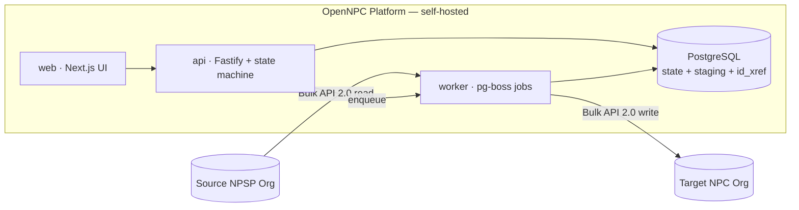

# OpenNPC Migration Platform — Product Requirements Documentation

> **Status:** Draft `v0.1` · **License:** MIT (proposed) · **Type:** Free & open-source

OpenNPC is a free, open-source platform that migrates a properly-built **Salesforce Nonprofit
Success Pack (NPSP)** org into a fresh **Salesforce Nonprofit Cloud (NPC)** org. You connect both
orgs, then progress through a **5-stage, restartable migration** — Analyze → Extract → Transform →
Load → Validate — where every stage saves its own progress, can be re-run in isolation, and pauses
for human review before continuing.

It is **not** built inside Salesforce. It is an externally-hosted application (self-hostable via
Docker) that talks to both orgs over the Salesforce APIs.

---

## Why this exists

There is **no supported one-click NPSP → NPC migration**. The two products have fundamentally
different data models: NPSP is a *managed package* on custom objects (`npsp__`, `npe01__`,
`npe03__`, `npe4__`, `npe5__`) with a Household-Account model; NPC is *standard objects*
(`GiftTransaction`, `GiftCommitment`, `Designation`, …) on a Person-Account / Party model. Migrating
means **translating the data model and re-pointing every relationship** from old IDs to new ones —
exactly the kind of work that benefits from a transparent, auditable, repeatable pipeline.

---

## Read in this order

| # | Document | What it covers |
|---|----------|----------------|
| — | [README.md](README.md) | This index |
| 01 | [Vision & Goals](01-vision-and-goals.md) | Why we're building it, goals, non-goals, principles |
| 02 | [Scope & Personas](02-scope-and-personas.md) | Who it's for, user stories, in/out of scope, user journey |
| 03 | [Architecture](03-architecture.md) | System components, tech stack, deployment topology |
| 04 | [Migration Workflow](04-migration-workflow.md) | **The 5-stage durable state machine** (start here for the core idea) |
| 05 | [Data-Model Mapping](05-data-model-mapping.md) | **NPSP → NPC object & field mapping** (the heart of the product) |
| 06 | [Database Schema](06-database-schema.md) | Postgres tables, the `id_xref` remapping table, ER diagram |
| 07 | [Salesforce Integration](07-salesforce-integration.md) | ECA OAuth, Bulk API 2.0, schema discovery, target prep |
| 08 | [Transformation Engine](08-transformation-engine.md) | Mapping definitions, the transform engine, validators |
| 09 | [Validation & Reporting](09-validation-and-reporting.md) | Reconciliation, rollups, migration reports |
| 10 | [API & Jobs](10-api-and-jobs.md) | REST API surface, pg-boss background jobs |
| 11 | [Frontend & UX](11-frontend-ux.md) | Screens, the mapping editor, review gates |
| 12 | [Security](12-security.md) | Read-only source, token encryption, secrets, PII-safe logging |
| 13 | [Roadmap & Milestones](13-roadmap-and-milestones.md) | MVP → v1.0 → v2.0, sprint breakdown |
| 14 | [Testing Strategy](14-testing-strategy.md) | Unit/integration/e2e, robustness & scale tests |
| 15 | [Repository Structure](15-repository-structure.md) | Monorepo layout and key modules |
| 16 | [Contributing](16-contributing.md) | How to contribute, add mappings, dev setup |
| 17 | [Multi-Tenant & Cross-Org OAuth Setup](17-multi-tenant-and-oauth-setup.md) | Distributed OAuth app + multi-tenant architecture (connect any org, many users) |
| 18 | [Migration Guide for Operators](18-migration-guide-for-operators.md) | **Plain-language, step-by-step walkthrough** for running a migration (no engineering background assumed) — mirrors the in-app Guide |
| — | [**planning_for_migration/**](planning_for_migration/README.md) | **The evidence-based completeness program**: gap analysis against a real org, the verified NPSP↔NPC object map, engine architecture, and the phased roadmap. Where this folder disagrees with 01–18, **it wins**. |

---

## Architecture at a glance

## The 5 stages

1. **Analyze** — connect both orgs, discover schemas, count records, auto-draft the mapping, produce a readiness report.
2. **Extract** — pull source data into Postgres staging via Bulk API 2.0 (PK chunking for large objects).
3. **Transform** — convert the NPSP data model to NPC shape, build the ID cross-reference, and prepare the target org's schema.
4. **Load** — upsert into NPC in dependency order using external IDs (idempotent, re-runnable).
5. **Validate** — reconcile counts and totals, trigger rollups, produce a migration report.

Each stage is a node in a **durable state machine**: it persists progress, is restartable after
failure, has a human review gate, and can be re-run on its own. See
[04-migration-workflow.md](04-migration-workflow.md).

---

## Tech stack (summary)

| Concern | Choice |
|---------|--------|
| Language / runtime | Node.js 20 + TypeScript |
| Salesforce client | jsforce v3 (Bulk API 2.0, OAuth, Metadata/Tooling) |
| Database | PostgreSQL (state, staging, ID cross-reference) |
| Job queue | **pg-boss** (Postgres-backed — no Redis required) |
| ORM / migrations | Prisma |
| API service | Fastify |
| Web UI | Next.js (App Router) + React |
| Org auth | OAuth 2.0 Authorization Code + PKCE via **External Client App** |
| Packaging | pnpm workspaces (monorepo), Docker Compose |

> **Note on Salesforce specifics:** Connected Apps are deprecated, so org auth uses **External
> Client Apps**. NPC's standard-object API names continue to evolve — this documentation treats them
> as sensible defaults that the Analyze stage confirms against each org's live schema before loading.
